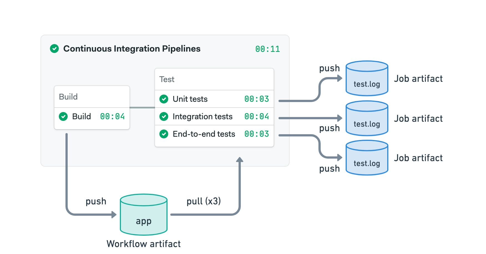
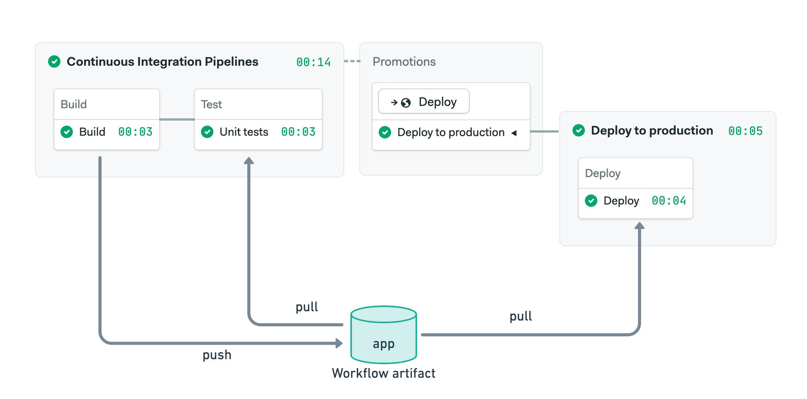
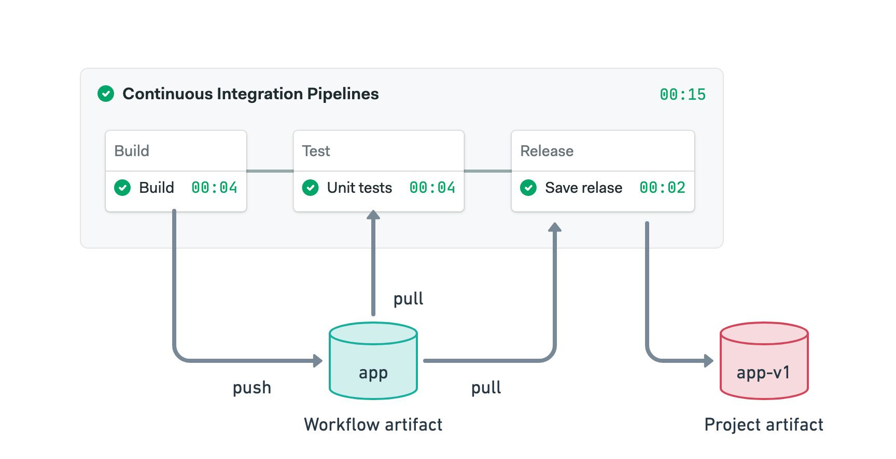
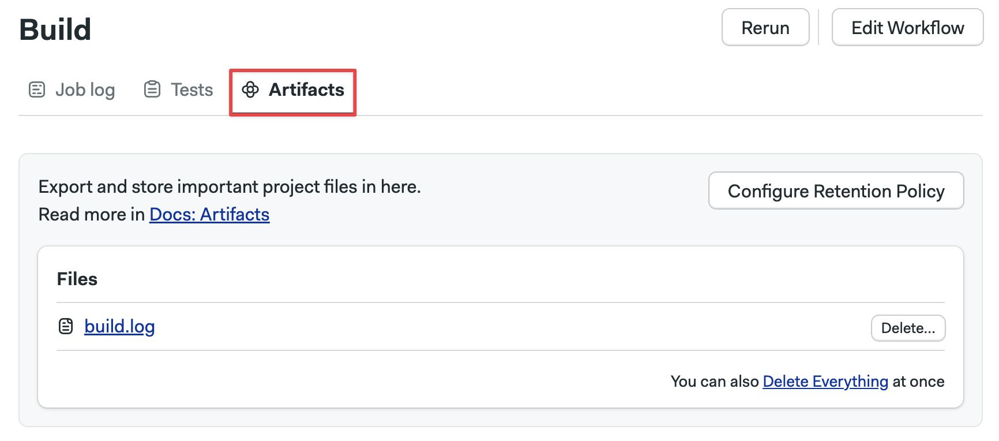
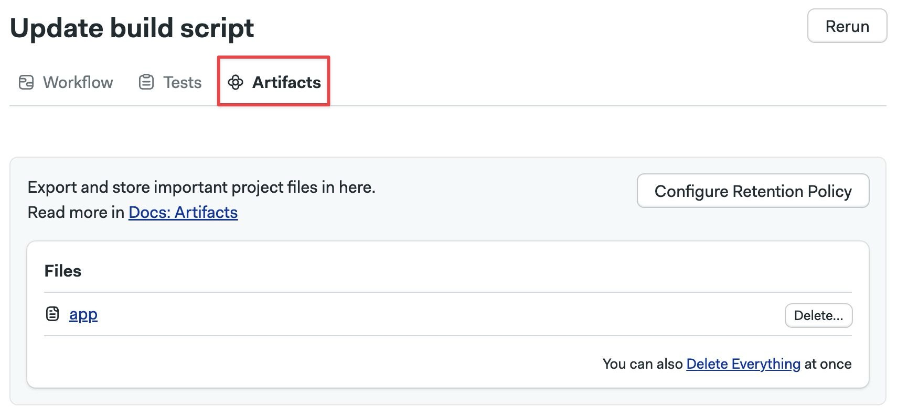
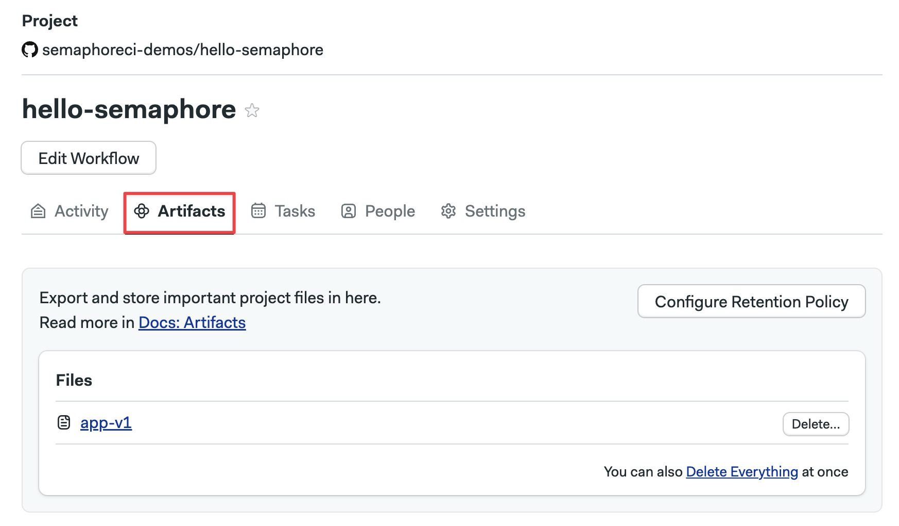
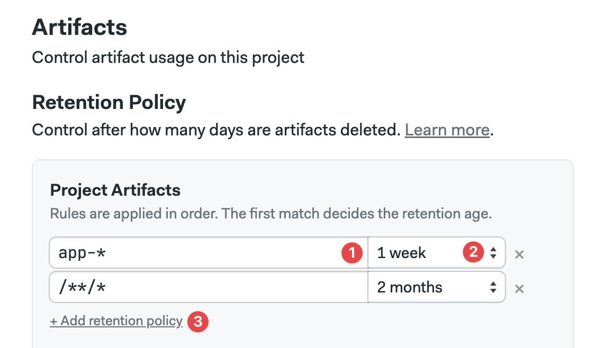
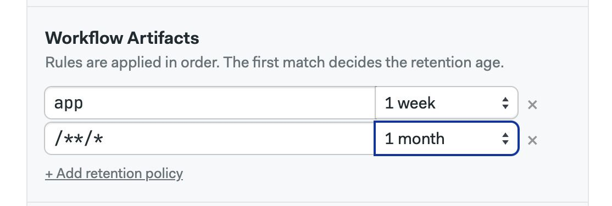
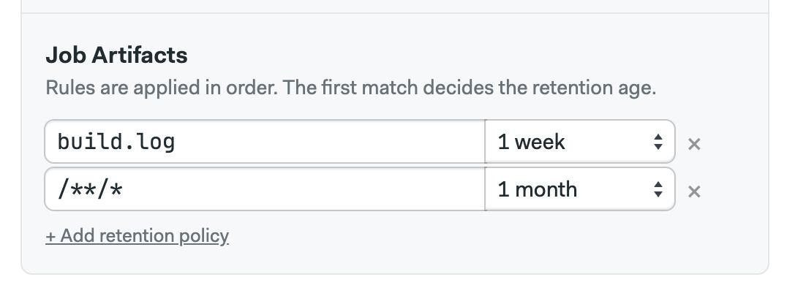

# Artifacts

import Tabs from '@theme/Tabs';
import TabItem from '@theme/TabItem';
import Available from '@site/src/components/Available';
import VideoTutorial from '@site/src/components/VideoTutorial';

<VideoTutorial title="How to use artifacts" src="https://www.youtube.com/embed/yHzZOKwyaAA?si=7qVathl09Cd3d-Gq"/>

Artifacts provide persistent storage for files and folders. This page explains how to store, retrieve and view artifacts and how to manage retention policies.

:::warning

Using artifacts can cost money. We recommend reading the [usage princing](#usage) and setting up [retention policies](#retention).

:::

## Overview {#overview}

Artifacts provide a persistent file store for all your [projects](./projects). Artifacts are ideal for:

- passing files between [jobs](./jobs) like build artifacts or compiled executables
- long-term storage for final deliverables
- collecting debug data from your jobs like screenshots and build logs
- store test results for processing [Test Reports](./test-reports) and [Flaky Tests](./flaky-tests)

:::note

Using artifacts in [self-hosted agents](./self-hosted) requires additional setup steps.

:::

## Artifact usage {#usage}

The `artifact` command is available in all [agents](./pipelines#agents). 

The syntax to send files or folders to the store is:

```shell
artifact push <namespace> /path/to/file/or/folder
```

To retrieve files or folders from the store:

```shell
artifact pull <namespace> <file or folder name>
```

Add the `--force` option to overwrite files or folders with the pull or push actions. For more information on syntax, see the [Semaphore toolbox page].


## Artifact namespaces {#namespaces}

The artifact store is partitioned in three namespaces:

- **job**: each job gets a dedicated namespace on every run. Job artifacts are suitable for collecting debug data
- **workflow**: accessible to jobs for all [pipelines](./pipelines) in a run. Workflow artifacts are ideal for passing data between jobs
- **project**: a global namespace for the project. Project artifacts are ideal for storing final deliverables.

### Job artifacts {#jobs}

The job namespace is not shared between jobs. Instead, each job gets assigned a dedicated namespace in every run.

Job artifacts are great to store debugging data such as build logs, screenshots and screencasts. In other words, any situation where you don't need to share data with other jobs.

The following example shows a common combination of job and workflow artifacts:

1. We use the workflow artifact to pass the compiled application from the build to the test jobs
2. Each test job pushes its test log to the job artifact


<Tabs groupId="editor-yaml">
<TabItem value="editor" label="Editor">



</TabItem>
<TabItem value="yaml" label="YAML">

```yaml title=".semaphore/semaphore.yml"
version: v1.0
name: Continuous Integration Pipelines
agent:
  machine:
    type: e1-standard-2
    os_image: ubuntu2004
blocks:
  - name: Build
    dependencies: []
    task:
      jobs:
        - name: Build
          commands:
            - checkout
            - make build
            - artifact push workflow app
  - name: Test
    dependencies:
      - Build
    task:
      jobs:
        - name: Unit tests
          commands:
            - checkout
            - artifact pull workflow app
            - make unit
            - artifact push job test.log
        - name: Integration tests
          commands:
            - checkout
            - artifact pull workflow app
            - make integration
            - artifact push job test.log
        - name: End-to-end tests
          commands:
            - checkout
            - artifact pull workflow app
            - make e2e
            - artifact push job test.log
```

</TabItem>
</Tabs>

See the YAML to view the commands used in the example.

### Workflow artifacts {#workflows}

The workflow artifact is used to pass data between jobs in the same run. This namespace is accessible to all pipelines, even those connected with [promotions](./promotions).

The following example shows how to use the workflow artifact to pass a compiled binary between the build, test and deploy jobs. Note that the deploy job can access the workflow artifact even when located in a different pipeline.

<Tabs groupId="editor-yaml">
<TabItem value="editor" label="Editor">


</TabItem>
<TabItem value="yaml" label="YAML">

```yaml title=".semaphore/semaphore.yml"
version: v1.0
name: Continuous Integration Pipelines
agent:
  machine:
    type: e1-standard-2
    os_image: ubuntu2004
blocks:
  - name: Build
    dependencies: []
    task:
      jobs:
        - name: Build
          commands:
            - checkout
            - make build
            - artifact push workflow app
  - name: Test
    dependencies:
      - Build
    task:
      jobs:
        - name: Unit tests
          commands:
            - checkout
            - artifact pull workflow app
            - make tests
promotions:
  - name: Deploy
    pipeline_file: deploy.yml
```

This is the deployment pipeline:

```yaml title=".semaphore/deploy.yml"
version: v1.0
name: Deploy to production
agent:
  machine:
    type: e1-standard-2
    os_image: ubuntu2004
blocks:
  - name: Deploy
    task:
      jobs:
        - name: Deploy
          commands:
            - checkout
            - artifact pull workflow app
            - make deploy
```
</TabItem>
</Tabs>

See the YAML to view the commands used in the example.

### Project artifacts {#projects}

The project namespace is globally shared for all runs in a given [project](./projects). This namespace is used to store final deliverables such as compiled binaries.

In the following example we use the workflow and project artifacts:

1. The workflow artifact is used to pass the compiled binary between the build and the other jobs
2. Once tests pass, the binary is tagged with the version number and stored in the project artifact

<Tabs groupId="editor-yaml">
<TabItem value="editor" label="Editor">


</TabItem>
<TabItem value="yaml" label="YAML">

```yaml title=".semaphore/semaphore.yml"
version: v1.0
name: Continuous Integration Pipelines
agent:
  machine:
    type: e1-standard-2
    os_image: ubuntu2004
blocks:
  - name: Build
    dependencies: []
    task:
      jobs:
        - name: Build
          commands:
            - checkout
            - make build
            - artifact push workflow app
  - name: Test
    dependencies:
      - Build
    task:
      jobs:
        - name: Unit tests
          commands:
            - checkout
            - artifact pull workflow app
            - make tests
  - name: Release
    dependencies:
      - Test
    task:
      jobs:
        - name: Save relase
          commands:
            - artifact pull workflow app
            - mv app app-$SEMAPHORE_GIT_TAG_NAME
            - artifact push project app-$SEMAPHORE_GIT_TAG_NAME
```

</TabItem>
</Tabs>

See the YAML to view the commands used in the example.

## How to view artifacts {#view-artifacts}

In addition to accessing artifacts from the job using the `artifact` command, you can view, delete, and download artifacts from the website.

### Job artifacts {#view-job}

Open the job log and go to the **Artifacts** tab. All the artifact for this job are shown.



Here you can:

- Open folders and view their contents
- Click on files to download them
- Press **Delete** to delete the artifact
- Press **Delete Everything** to delete all the files in the current folder
- Press the **Configure retention policy** to configure the [artifact retention](#retention)

### Workflow artifacts {#view-workflow}

To view the workflow artifacts, open the workflow and go to **Artifacts**.



Here you can:

- Open folders and view their contents
- Click on files to download them
- Press **Delete** to delete the artifact
- Press **Delete Everything** to delete all the files in the current folder
- Press the **Configure retention policy** to configure the [artifact retention](#retention)

### Project artifacts {#view-project}

To view the project artifacts, open your project in Semaphore and select **Artifacts**.



Here you can:

- Open folders and view their contents
- Click on files to download them
- Press **Delete** to delete the artifact
- Press **Delete Everything** to delete all the files in the current folder
- Press the **Configure retention policy** to configure the [artifact retention](#retention)

## Retention policies {#retention}

Semaphore will never delete your artifacts automatically. To control usage and [costs](#usage), it's recommended to set up retention policies to automatically delete old artifacts.

Retention policies are rule-based and namespace-scoped. You must create one or more rules with a file selectors and ages. Semaphore attempts to match each rule to existing files and delete them if they exceed the maximum age.

### How to create retention policies

You can access the retention policy settings in the following ways:

- Pressing **Configure Retention Policy** in the [job artifacts](#view-job), [workflow artifacts](#view-workflow), or [project artifacts](#view-project)
- Selecting the **Artifacts** section in your [project settings](./projects#settings)

The retention policy menu lets you create rules for all the [artifact namespaces](#namespaces).

To create a retention rule:

1. Type the file selector
2. Select the maximum age
3. Click **+ Add retention policy** to add more rules



Repeat the process for the workflow artifacts:



And, finally, set up retention policies for the job artifacts:



:::info

Semaphore checks and applies the rules the retention policies in your project once every day.

:::

### Retention policies selectors

The file selector accepts star (`*`) and double-star (`**`) glob patterns. For example:

- `/**/*` matches all files and folders in the namespace. We recommend setting this rule at the end of the list
- `/logs/**/*.txt` matches all files with txt extension in the logs folder or any subfolders
- `/screenshots/**/*.png` matches all png files in the screenshots folder and subfolders
- `build.log` matches the file exactly

## Usage pricing {#usage}

Artifacts on the Semaphore Cloud are charged on the basis of:

- **Storage**: the amount of data stored, charged on a GB per month basis
- **Traffic**: download network traffic in jobs or from the website, charged in total GB of data per month

For more information, see [Plans and Pricing](https://semaphoreci.com/pricing)

:::note

If you're using [self-hosted agents], prices may differ.

:::

## See also

- [Semaphore toolbox]
- [Test reports](./test-reports.md)
- [Flaky tests](./flaky-tests.md)
- [Using artifacts in jobs](./jobs#artifact)

